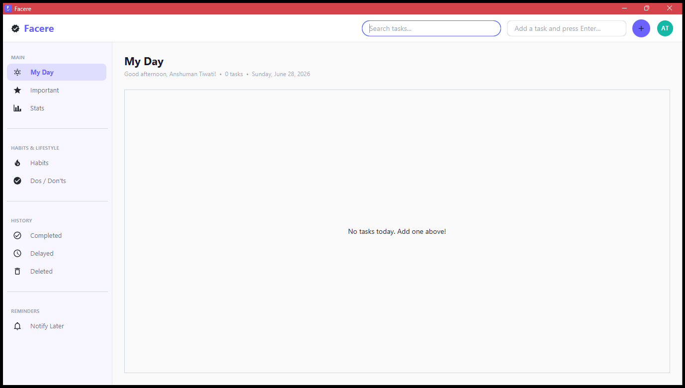
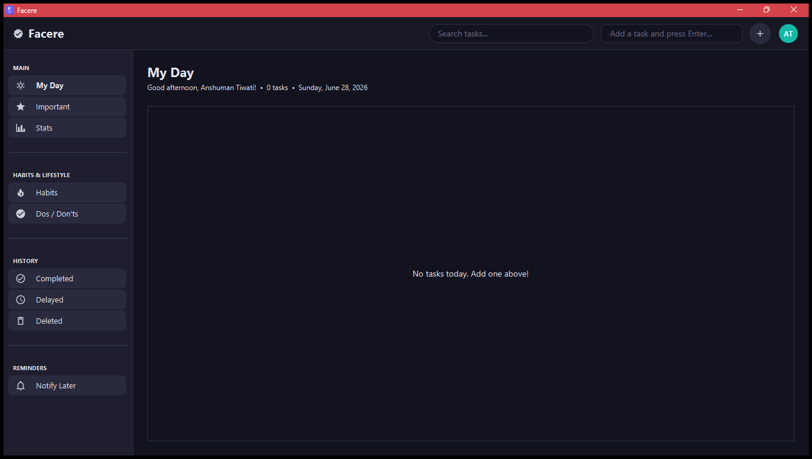
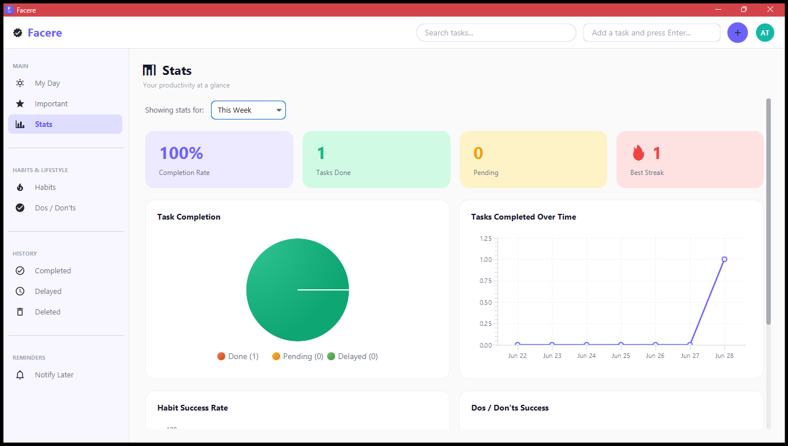
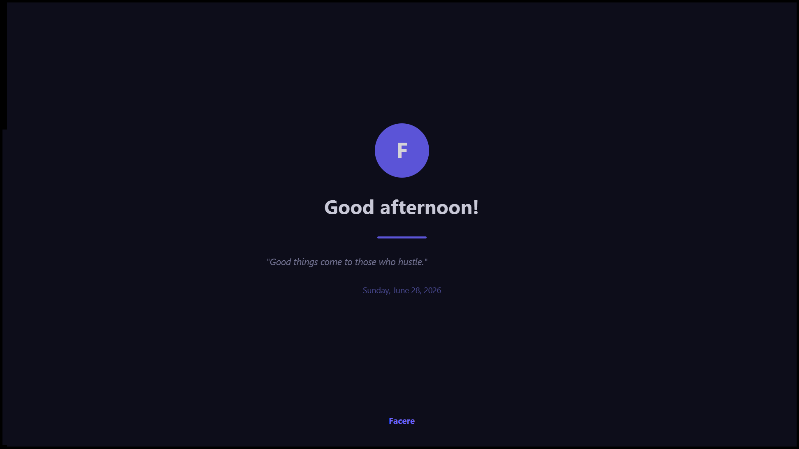
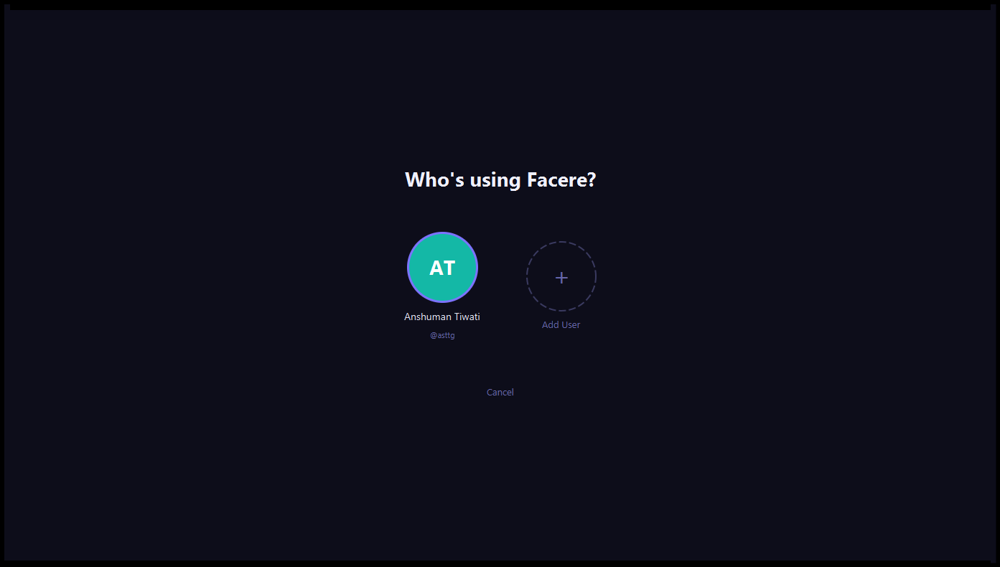
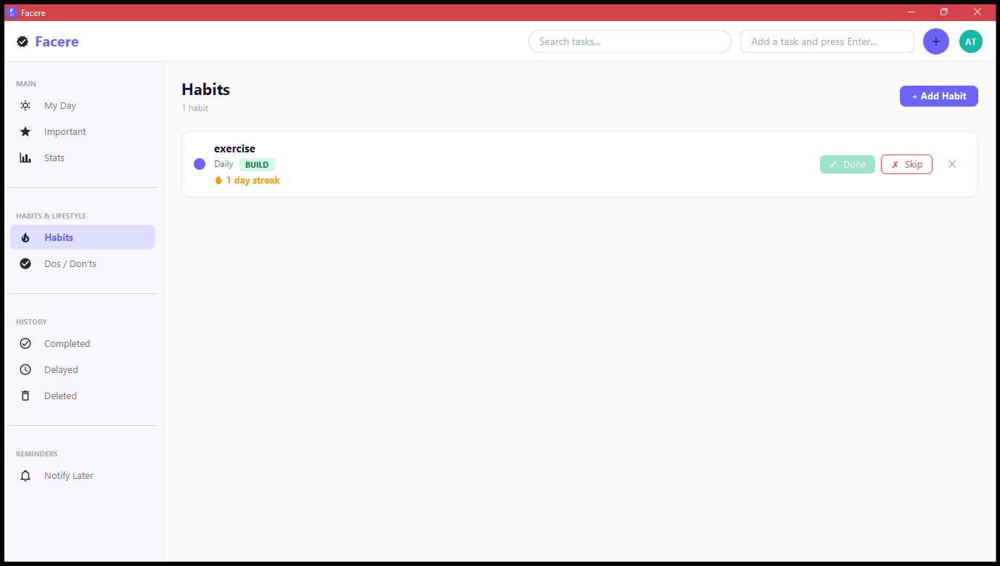

# Facere

A premium desktop productivity application built with JavaFX for Windows. Track habits, manage tasks, set goals, and monitor your progress — all in a beautiful, animated interface.

> *Facere* — Latin for "to do, to make"


---

## Features

### Task Management
- Quick-add tasks from the top bar or detailed Add Task modal
- Organize by sections: My Day, Important, Notify Later
- Set priority levels (Low, Normal, High, Critical) with colour-coded strips
- Mark tasks Done, Delay, or Delete with one click
- Full task descriptions displayed in multi-line cards
- Search across task titles and descriptions with debounced input

### Habit Tracking
- Create Build and Break habits with custom recurrence
- Daily check-in: Done / Skip with streak tracking
- Current and longest streak tracking with fire emoji display
- Colour-coded habit cards

### Dos / Don'ts
- Side-by-side panels for daily Do and Don't items
- Track success with Did it / Avoided / Skipped logging
- Daily status tracking per item

### Stats Dashboard
- 4 number cards: Completion Rate, Tasks Done, Pending, Best Streak
- Donut chart for task completion breakdown
- Line chart for tasks completed over time
- Bar charts for habit and dos/don'ts success rates
- Time range selector: Today, This Week, This Month, All Time
- All charts are theme-aware and animated on entrance

### Multi-User Support
- Up to 3 separate user profiles
- Google-style coloured avatar circles with initials
- Each user has completely separate data
- User picker screen on every app launch
- Add, switch, and delete users from the profile menu

### Theme Engine
- 4 theme modes: Light, Dark, Auto (System), Auto (Time of Day)
- Smooth crossfade animation between themes
- Dark mode with fully styled charts, cards, and popups
- System theme detection via Windows registry

### Security
- Optional 6-digit PIN lock per user
- Keyboard-only PIN entry with animated dot indicators
- Green dots on correct PIN, red dots + shake on wrong
- 5-attempt lockout with 30-second cooldown
- BCrypt password hashing (cost factor 12)

### Polish & Animations
- Full-screen splash greeting with time-based salutation
- 90 daily rotating motivational quotes
- Section fade transitions on sidebar navigation
- Task card slide-in animations (optimized — only on load, not scroll)
- Sidebar hover micro-animations
- Stats chart entrance animations (fade + scale)
- Custom profile card popup with smooth entrance
- App remembers window position, size, and maximized state
- Factory reset option in settings

---

## Screenshots

### My Day — Light Mode


### My Day — Dark Mode


### Stats Dashboard


### Splash Greeting


### User Picker


### Habits


---

## Tech Stack

| Component | Technology |
|---|---|
| Language | Java 25 (Eclipse Adoptium) |
| UI Framework | JavaFX 25 LTS |
| Theme | AtlantaFX 2.1.0 (Primer Light/Dark) |
| Database | SQLite 3.53 via JDBC |
| Icons | Ikonli 12.4.0 (Material Design 2) |
| Controls | ControlsFX 11.2.2 |
| Security | BCrypt (at.favre.lib) |
| System Theme | jSystemThemeDetector 3.9 |
| JSON | Jackson 2.19 |
| Logging | SLF4J 2.0 + Logback 1.5 |
| Build | Maven 3.9 |
| Installer | jpackage + WiX Toolset |

---

## Architecture

```
src/main/java/com/habitflow/
├── app/
│   ├── HabitFlowApp.java
│   └── Launcher.java
├── controller/
│   ├── MainController.java
│   ├── HabitsController.java
│   ├── DoDontsController.java
│   ├── StatsController.java
│   ├── SplashController.java
│   ├── LockScreenController.java
│   ├── UserPickerController.java
│   ├── ProfileSetupController.java
│   ├── ProfileMenuController.java
│   ├── AddTaskModal.java
│   ├── SecuritySetupController.java
│   └── DueTasksModalController.java
├── dao/
│   ├── DatabaseManager.java
│   ├── SchemaExecutor.java
│   ├── AppDatabase.java
│   ├── TaskDAO.java
│   ├── HabitDAO.java
│   ├── DoDontDAO.java
│   ├── UserDAO.java
│   └── UserMigration.java
├── model/
│   ├── Task.java
│   ├── Habit.java
│   ├── DoDont.java
│   └── User.java
├── service/
│   ├── ThemeManager.java
│   ├── SecurityManager.java
│   └── UserSession.java
└── util/
    ├── AnimationHelper.java
    └── AppIcon.java
```

## Getting Started

### Prerequisites

- **Java JDK 25** — [Eclipse Adoptium](https://adoptium.net/)
- **Maven 3.9+** — [Download](https://maven.apache.org/download.cgi)
- **Windows 10/11**

### Build & Run

```bash
# Clone the repository
git clone https://github.com/lazyanshuman/Facere.git
cd facere

# Run the application
mvn javafx:run

# Build the fat JAR
mvn clean package -DskipTests

# Build the Windows installer (requires WiX Toolset)
jpackage --name "Facere" --app-version "1.0.0" \
  --vendor "Anshuman Tiwari" \
  --description "Premium habit and task tracking desktop app" \
  --icon "facere_icon.ico" \
  --dest "installer" --input "target" \
  --main-jar "habitflow-desktop-1.0.0-SNAPSHOT.jar" \
  --main-class "com.habitflow.app.Launcher" \
  --type exe --win-menu --win-shortcut --win-dir-chooser \
  --win-menu-group "Facere"
```

---

## Database

Facere uses SQLite with the database stored at:
%APPDATA%\Facere\facere.db

The schema auto-creates on first launch. Multi-user data migration runs automatically when upgrading from single-user to multi-user.

---

## License

This project is licensed under the MIT License — see the [LICENSE](LICENSE) file.

---

## Author

**Anshuman Tiwari**

Built with dedication as a complete desktop application project.